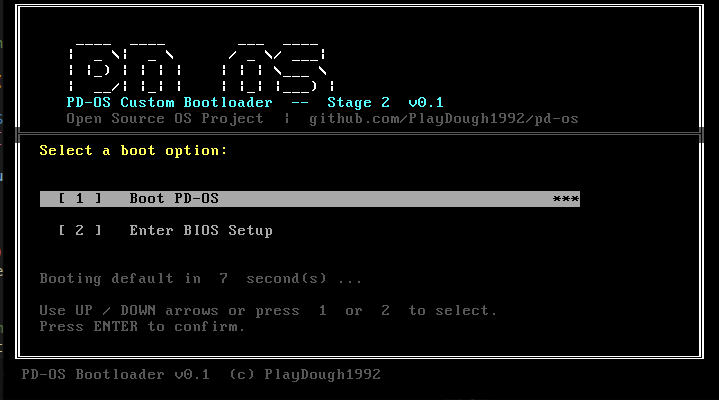
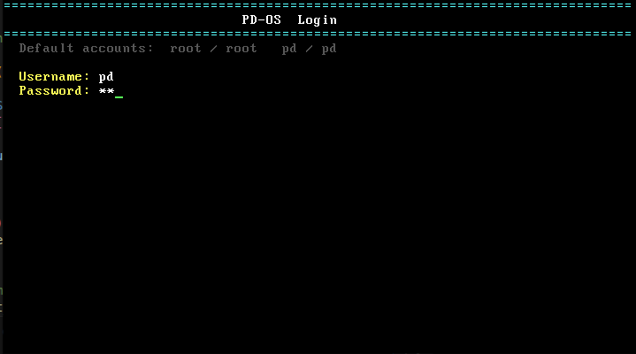
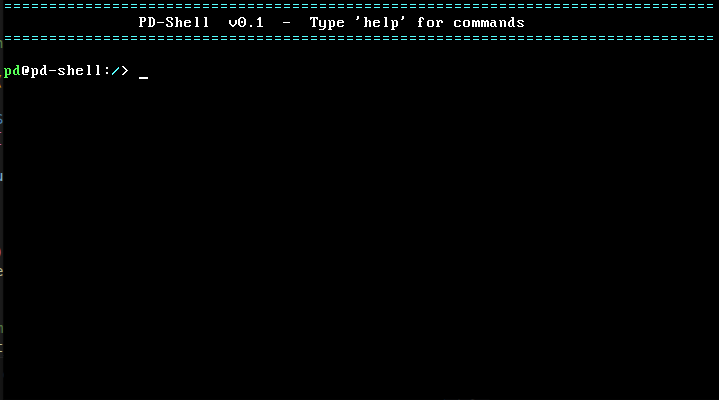
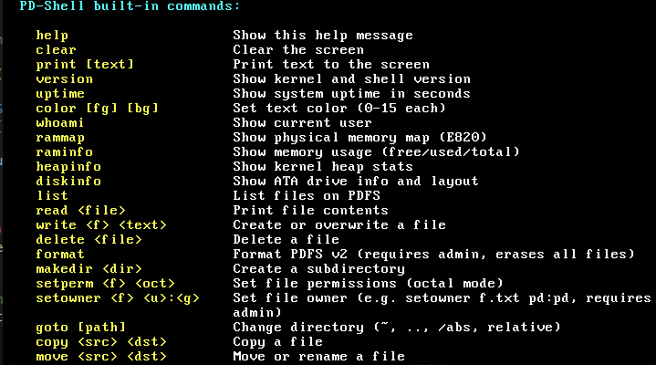
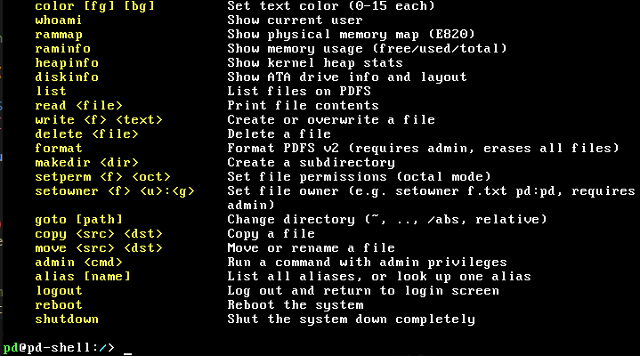
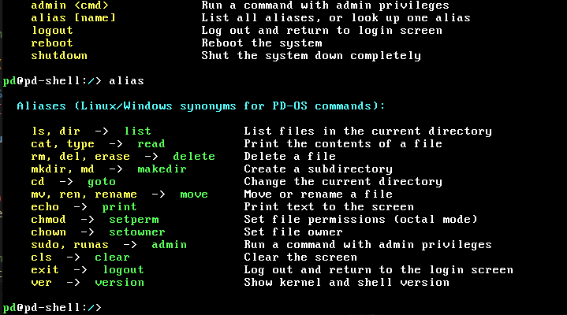
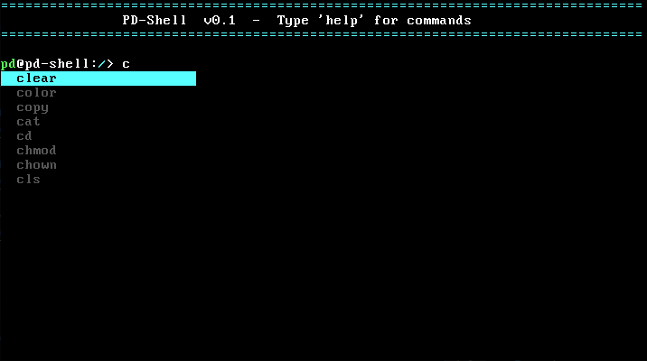
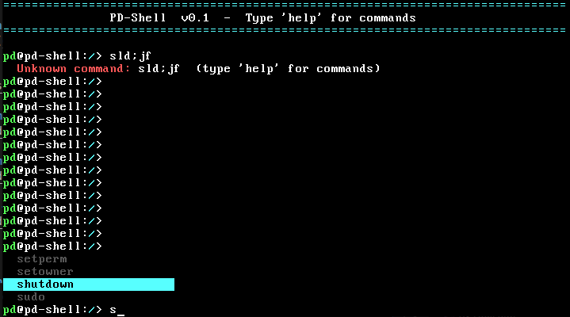
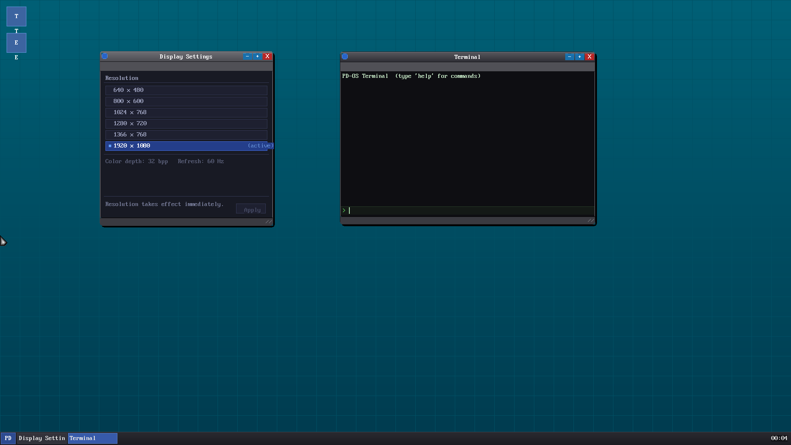

# PD-OS - A Completely Custom Operating System

## 🌟 About

**A completely open source brand new operating system, custom bootloader, kernel, CLI and GUI.**

PD-OS is **NOT** Linux-based, **NOT** Windows-based, **NOT** Mac-based. This is a completely custom operating system built from the ground up.

- ⚙️ **Custom Bootloader** — No GRUB, we built our own (PD-Bootloader v0.1)
- 🔧 **Custom Kernel** — Not the Linux kernel, not any existing kernel (PD-Kernel)
- 🗄️ **Custom Filesystem** — PDFS v2, a native persistent filesystem with subdirs and Unix permissions
- 💻 **Custom CLI** — PD-Shell with 29 built-in commands, command history, tab completion, live suggestion menu, and multi-user support
- ⚡ **Preemptive Multitasking** — Round-robin scheduler, per-process PCB table, IRQ0 context switching, idle task
- 🤝 **Community Driven** — Like Linux in spirit, but completely independent in code

**We are hoping the dev communities will reach out to help with this project!** This is an ambitious undertaking to create a truly new operating system from scratch. All contributions, ideas, and collaboration are welcome.

---

## 🖥️ Screenshots

### Stage 2 Bootloader — TUI Boot Menu


### Login Screen


### PD-Shell


### Built-in Commands — `help` (page 1)


### Built-in Commands — `help` (page 2)


### Alias Table — `alias`


### Autocomplete Suggestion Menu
Typing a prefix instantly shows a live context menu of matching commands. Use ↑/↓ to navigate, Space to confirm.





### GDE - PD-OS's official Graphical Desktop Environment
Simple desktop environment for GUI users to check out.



---

## 🎯 Project Goals

- ✅ Custom bootloader (no GRUB dependency)
- ✅ 32-bit x86 protected-mode kernel
- ✅ Physical memory manager, paging, kernel heap
- ✅ User account system (login, passwords, uid, root)
- ✅ ATA/IDE disk driver + Virtual Filesystem Switch (VFS)
- ✅ Native persistent filesystem (PDFS v2) with subdirs & Unix permissions
- ✅ Read-only drivers for FAT32, ext2, NTFS
- ✅ Full CLI shell (PD-Shell) with 27 commands and CWD navigation
- ✅ Command history (↑/↓ navigation, 32-entry ring buffer)
- ✅ Tab completion (commands + filesystem) and live autocomplete suggestion menu
- ✅ Process management — PCB table, round-robin scheduler, IRQ0 preemption, `ps`/`kill`
- ⬜ Graphical desktop environment (future)

---

## 📋 Current Status

**Phase 10 — Process Management: COMPLETE ✓**

### Completed
- ✅ Project directory structure and build system (`build.sh`)
- ✅ PD-Bootloader Stage 1 (512-byte MBR)
- ✅ PD-Bootloader Stage 2 (A20, GDT, E820 memory map, protected mode, TUI boot menu)
- ✅ PD-Kernel foundation (VGA text driver, kprintf, kernel panic)
- ✅ IDT, PIC, PIT (100 Hz), keyboard driver (PS/2 Set 1, IRQ1)
- ✅ E820 physical memory map, bitmap PMM, 4 KB paging, kernel heap (kmalloc/kfree)
- ✅ User account system (FNV-1a hashed passwords, uid/gid, root flag, 3-attempt lockout)
- ✅ ATA/IDE PIO driver (28-bit LBA, primary channel, single-sector reads/writes)
- ✅ VFS layer (driver registry, mount table, path dispatch)
- ✅ PDFS v2 — native persistent filesystem:
  - 64-byte dirents, 32 entries × 4-sector root dir
  - Subdirectories with independent dir tables
  - Unix rwxrwxrwx permissions (owner/group uid + mode bits)
  - Monotonic sector allocator (`next_free_lba`)
  - Single-sector targeted flushes (no journaling overhead)
- ✅ Read-only filesystem drivers: FAT32, ext2, NTFS
- ✅ PD-Shell with 26 built-in commands, CWD state, color prompt
- ✅ ATA reserved-sector guard (refuses writes to LBA < 200)
- ✅ Process management — PCB table (16 slots), round-robin scheduler, IRQ0 preemptive context switching
- ✅ Dedicated `irq0_preempt` ASM stub — saves/restores full interrupt frame, performs ESP-level task switch
- ✅ `idle` task (HLT loop) created at boot; boot thread registered as pid 0 (`kernel/shell`)

### Default User Accounts

| Username | Password | UID | Role |
|----------|----------|-----|------|
| `root`   | `root`   | 0   | Superuser (`USER_FLAG_ROOT`) |
| `pd`     | `pd`     | 1   | Standard user |

> Passwords are hashed with FNV-1a 32-bit at boot. Plaintext is zeroed from memory immediately after hashing.

### PD-Shell Commands

| Command | Description |
|---------|-------------|
| `help` | Show all commands |
| `clear` | Clear the screen |
| `echo [text]` | Print text to the terminal |
| `version` | Show kernel and shell version |
| `uptime` | Show system uptime in seconds |
| `color <fg> <bg>` | Set terminal text colors (0–15) |
| `whoami` | Show current user and uid |
| `memmap` | Display E820 physical memory map |
| `meminfo` | Show PMM free/used page counts |
| `heap` | Show kernel heap usage |
| `diskinfo` | Show ATA drive model and sector count |
| `ls [path]` | List directory contents (defaults to CWD) |
| `cat <file>` | Print file contents |
| `write <file> [text]` | Create or overwrite a file |
| `rm <file>` | Delete a file |
| `mkdir <dir>` | Create a directory |
| `mkpdfs` | Format the PDFS volume (destructive) |
| `sdir [path]` | Change directory (`~`, `..`, absolute, relative) |
| `copy <src> <dst>` | Copy a file |
| `move <src> <dst>` | Move / rename a file |
| `setp <file> <octal>` | Set file permissions (e.g. `setp f.txt 644`) |
| `seto <file> <u>:<g>` | Set file owner (e.g. `seto f.txt pd:pd`) |
| `elev <command>` | Run a command with elevated (root) privileges |
| `sudo <command>` | Alias for `elev` — run with elevated privileges |
| `logout` | Log out and return to the login screen |
| `reboot` | Reboot the system |
| `shutdown` | Shut the system down completely |
| `ps` | List all processes (PID, state, ticks, name) |
| `kill <pid>` | Terminate a process by PID |

---

## 🚀 Quick Start

### Requirements

- `nasm` (assembler)
- `i686-linux-gnu-gcc` (cross-compiler — Linux hosted, 32-bit target)
- `qemu-system-i386` (emulator)
- `python3` (used by build.sh for PDFS/FAT/ext2/NTFS image init)

### Build & Run

```bash
# Build everything (bootloader, kernel, disk image, all filesystems)
bash build.sh

# Run in QEMU
qemu-system-i386 -drive format=raw,file=build/pd-os.img -m 128M -display sdl
```

### Default Login Credentials

```
Username: pd   Password: pd
Username: root Password: root
```

---

## 📁 Project Structure

```
pd-os/
│
├── bootloader/
│   ├── stage1.asm          # 512-byte MBR bootloader
│   └── stage2.asm          # Extended bootloader (A20, GDT, E820, TUI, PM)
│
├── kernel/
│   ├── arch/x86/
│   │   ├── entry.asm       # Kernel entry point, stack setup
│   │   ├── idt.asm         # IDT load (lidt)
│   │   └── sched_entry.asm # IRQ0 preemption stub (irq0_preempt)
│   ├── core/
│   │   ├── kernel.c        # Kernel main — init sequence
│   │   ├── process.c       # PCB table, scheduler, proc_create/kill
│   │   └── shell.c         # PD-Shell — readline, commands, CWD
│   ├── drivers/
│   │   ├── ata.c           # ATA/IDE PIO driver (28-bit LBA)
│   │   ├── keyboard.c      # PS/2 keyboard driver (IRQ1, Set 1)
│   │   ├── pic.c           # 8259A PIC driver
│   │   ├── pit.c           # 8253/8254 PIT (100 Hz)
│   │   └── vga.c           # VGA text mode driver (80×25, color)
│   ├── fs/
│   │   ├── vfs.c           # Virtual Filesystem Switch (mount table)
│   │   ├── pdfs.c          # PDFS v2 — native R/W filesystem
│   │   ├── fat32.c         # FAT32 read-only driver
│   │   ├── ext2.c          # ext2 read-only driver
│   │   └── ntfs.c          # NTFS read-only driver
│   ├── mm/
│   │   ├── pmm.c           # Physical memory manager (bitmap)
│   │   ├── paging.c        # 4 KB paging, kernel page tables
│   │   └── kheap.c         # Kernel heap (kmalloc / kfree)
│   └── include/            # Header files
│
├── build/                   # Build output (generated)
│   ├── bootloader.bin
│   ├── kernel.bin
│   └── pd-os.img           # Bootable raw disk image (64 MB)
│
├── build.sh                 # Primary build script
├── commit.sh                # Commit to linux-build-env + sync main
├── PD-OS-plan.md            # Original implementation plan
└── PROJECT_STATUS.md        # Phase-by-phase status log
```

---

## 🗺️ Development Roadmap

### Phase 1 — Environment Setup ✅
Directory structure, build system, toolchain guide.

### Phase 2 — Bootloader Stage 1 ✅
512-byte MBR, boot signature, BIOS text output.

### Phase 3 — Bootloader Stage 2 ✅
A20 line, GDT + protected mode transition, E820 memory detection, TUI boot menu with countdown, INT 13h LBA kernel load.

### Phase 4 — Kernel Foundation ✅
Kernel entry point (ASM → C), VGA text driver (80×25, hardware cursor), `kprintf`, kernel panic handler.

### Phase 5 — Interrupts ✅
IDT (256 gates), 8259A PIC remapping, PIT at 100 Hz, PS/2 keyboard driver (IRQ1, Set 1 scancodes, readline with mid-line editing).

### Phase 6 — PD-Shell + User System ✅
Login screen (3-attempt lockout), FNV-1a password hashing (plaintext zeroed after boot), user table (uid, gid, root flag), PD-Shell Tier 1 (help, echo, version, color, whoami, logout, reboot, shutdown).

### Phase 7 — Memory Management ✅
E820 memory map parsing, bitmap PMM (4 KB pages), kernel-space paging (identity map + MMIO), `kmalloc`/`kfree` heap.

### Phase 8 — Storage & Filesystem ✅
- ATA/IDE PIO driver (28-bit LBA, cache flush, reserved-sector guard)
- VFS layer (driver registry, mount table, longest-prefix dispatch)
- PDFS v2 — native read/write filesystem:
  - Superblock at LBA 200, root dir sectors 202–205, data from LBA 206
  - 64-byte dirents, 32 per directory, subdirectory support
  - Unix rwxrwxrwx permissions (uid/gid + mode bits)
  - Monotonic `next_free_lba` allocator, single-sector targeted writes
- FAT32, ext2, NTFS read-only drivers

### Phase 9a — PD-Shell Tier 2 ✅
`ls`, `cat`, `write`, `rm`, `mkdir`, `mkpdfs`, `copy`, `move`, `sdir` (cd with `~`/`..`/abs/rel), `setp` (chmod), `seto` (chown), `elev` (elevated privileges), `memmap`, `meminfo`, `heap`, `diskinfo`. CWD session state with `normalize_path()`.

### Phase 9b — Shell Quality-of-Life ✅
- ✅ Command history — 32-entry circular ring, ↑/↓ navigation, duplicate suppression
- ✅ Tab completion — command names (first token) and filesystem paths (arguments)
- ✅ Live autocomplete suggestion menu — UP/DOWN to navigate, Space to confirm
- ✅ Word-wrap in readline — whole words moved to next line at screen edge
- ✅ Input buffer expanded from 256 → 512 bytes
- ✅ Scroll anchor tracking — readline anchor stays correct after forced scrolls

### Phase 10 — Process Management ✅
- ✅ `process.h` / `process.c` — PCB table (16 slots), `proc_create`, `proc_kill`, `sched_irq` round-robin
- ✅ `sched_entry.asm` — dedicated `irq0_preempt` stub; saves full interrupt frame, switches ESP on context change
- ✅ `idt.c` — IRQ0 gate updated to `irq0_preempt`
- ✅ `kernel.c` — `proc_init()` + `idle_task` (HLT loop) at boot; banner updated
- ✅ Shell commands: `ps` (list all processes) and `kill <pid>`

### Phase 11 — Next
- ⬜ VFS population — `/home/<user>`, `/etc/pd-os/version`, `/pdsys/`, `/pdapps/` skeleton
- ⬜ Move user table to `/etc/passwd`; add `useradd`/`userdel` commands

### Future
- ⬜ GUI / VESA framebuffer graphics
- ⬜ Desktop environment

---

## 🧪 Testing

### QEMU (Recommended)

```bash
bash build.sh
qemu-system-i386 -drive format=raw,file=build/pd-os.img -m 128M -display sdl
```

### Real Hardware

After thorough emulator testing you can write the image to a USB drive:

```bash
# WARNING: Double-check your device name — this will erase it!
sudo dd if=build/pd-os.img of=/dev/sdX bs=4M status=progress
sync
```

---

## 🐛 Troubleshooting

### Build fails — cross-compiler not found
```bash
# Install the i686 cross-compiler (Debian/Ubuntu)
sudo apt install gcc-i686-linux-gnu binutils-i686-linux-gnu
```

### QEMU won't start
```bash
qemu-system-i386 --version    # verify it's installed
ls -lh build/pd-os.img        # verify image was created
```

### Disk image corrupt / unbootable after use
This was a previously fixed bug (PDFS dirent struct was 60B not 64B, causing a BSS overflow that zeroed `g_base_lba` and wrote the superblock over the MBR on every disk write). The ATA driver now also refuses all writes to LBA < 200 as a safety guard.

---

## 📚 Documentation

- **[PD-OS-plan.md](PD-OS-plan.md)** — Original implementation plan
- **[PROJECT_STATUS.md](PROJECT_STATUS.md)** — Phase-by-phase status log
- **[tools/setup.md](tools/setup.md)** — Toolchain setup guide

---

## 📖 Learning Resources

1. [OSDev Wiki](https://wiki.osdev.org/) — Comprehensive OS development reference
2. Intel x86 Software Developer Manuals — Architecture reference
3. NASM Documentation — Assembly syntax
4. *Operating Systems: Three Easy Pieces* — Arpaci-Dusseau
5. *Modern Operating Systems* — Tanenbaum

---

## 🤝 Contributing

**We Need Your Help!** This is an ambitious project to build a completely new operating system from scratch, and we're actively seeking contributors from the developer community.

### How You Can Help

**🔧 Development Areas:**
- Process management (PCBs, context switching, round-robin scheduler, ring 3)
- GUI / VESA framebuffer graphics
- Window manager and desktop environment
- Device drivers (mouse, USB, storage, sound)
- PDFS v2 enhancements (file append, directory listing improvements)
- Shell features (command history, tab completion, pipes/redirects)
- Network stack (very future)

**📚 Documentation:**
- Architecture deep-dives
- Developer tutorials
- Contribution guides

### Getting Started

1. Fork the repository
2. Install the toolchain (see requirements above)
3. `bash build.sh` — confirm zero warnings
4. Run in QEMU and explore
5. Pick an open item from the roadmap and submit a PR

---

*PD-OS — built from scratch, one sector at a time.*
- Comment and explain complex code sections

**🧪 Testing:**
- Test on different hardware configurations
- Report bugs and issues
- Validate build process on various systems
- Performance testing and optimization

**🎨 Design:**
- UI/UX design for future GUI
- CLI interface improvements
- Visual identity and branding

### Getting Started

1. **Fork the repository** on GitHub
2. **Clone your fork**: `git clone https://github.com/YOUR-USERNAME/pd-os.git`
3. **Create a branch**: `git checkout -b feature/your-feature-name`
4. **Make your changes** and test thoroughly
5. **Commit**: `git commit -m "Description of changes"`
6. **Push**: `git push origin feature/your-feature-name`
7. **Create a Pull Request** on GitHub

### Code Style

- Assembly: NASM syntax, clear comments explaining what and why
- C (future): K&R style, descriptive variable names
- Keep code readable - we're building something from scratch, clarity matters!

### Communication

- Open issues for bugs, features, or questions
- Discuss major changes before implementing
- Be respectful and collaborative - we're all learning!

### What We're Looking For

- **Experienced OS developers** - Architecture guidance and code reviews
- **Low-level programmers** - Assembly, C, system programming
- **Hardware enthusiasts** - Driver development, hardware debugging
- **Educators** - Help make this a great learning resource
- **Beginners** - Everyone starts somewhere! Documentation and testing are valuable

**Together, we can build something amazing!** 🚀

---

## 📝 License

This project is open source and available for educational purposes.

---

## 🎓 About

**Project**: PD-OS  
**Version**: 0.1.0 (Phase 9a Complete)  
**Started**: April 2026  
**Target**: Custom 32-bit x86 operating system  
**Learning Focus**: Low-level programming, OS architecture, systems development

---

*PD-OS — built from scratch, one sector at a time.*
